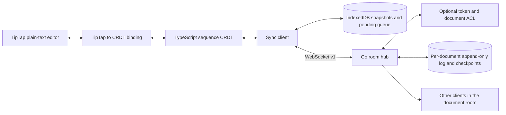

# SyncForge: Build and Project Guide

This guide describes the repository as it exists today: what the alpha contains, how its pieces work together, how to run and verify it, and what remains before a production service could be considered. It also summarizes the foundational scope and architecture established at the beginning of the project.

## 1. Project at a glance

SyncForge is a browser-first collaborative **plain-text** editing prototype. Each browser tab owns a local replica of a document. The TypeScript core converts edits into immutable insert/delete operations; the sync client queues and exchanges those operations through a Go WebSocket service. The service validates messages, routes operations to peers in the same document room, and persists accepted history so it can replay after a server restart.

The service is the transport and history provider. It does not interpret the document's visible text or run the CRDT on behalf of the clients. Clients independently apply the same valid operation set and are expected to converge.

**Current maturity:** Phases 0–6 of the initial alpha roadmap are complete. That means the documented alpha scope has a working implementation and tests; it does **not** mean the system has production-grade availability, security, scale, or operations.

## 2. What is implemented

### 2.1 TypeScript sequence CRDT

`packages/core` implements an RGA-style sequence document:

- Inserted Unicode code points have stable IDs composed of a replica ID and counter.
- An insert references its predecessor, or `null` for the root.
- Concurrent siblings use deterministic ordering: descending counter, then ascending replica ID.
- Deletes retain tombstones so later operations can still refer to deleted elements.
- Unknown predecessors and deletes are held pending and applied when the referenced element arrives.
- Snapshots preserve replica counters, elements, tombstones, and unresolved deletes.
- Duplicate inserts are idempotent; invalid operations and predecessor cycles are rejected.

This is a learning-oriented sequence CRDT, not a mature general-purpose editing algorithm. Tombstone garbage collection is deliberately absent because safe collection requires a defined replica-membership and offline-retention policy.

### 2.2 Versioned protocol and Go service

`packages/protocol-ts` and `server/internal/protocol` validate the version 1 JSON protocol. The WebSocket endpoint is `/sync`:

1. A peer opens the socket and sends `join` with protocol version, document ID, replica ID, and an optional auth token.
2. The service checks access, restores the document's history if necessary, queues history replay, and sends `joined` after replay.
3. The peer sends `operation` messages.
4. The service validates the room and replica identity, durably records a new operation, broadcasts it to other room peers, and sends `ack` to the sender.
5. Invalid messages and service errors are represented as protocol `error` messages.

Limits currently include 64 KiB per WebSocket frame, a 10-second join deadline, a 60-second pong timeout, 10,000 replay operations per document, and 32 MiB of replay payload per document. The origin check compares hostnames; deployments behind proxies must configure and test their proxy and TLS behavior carefully.

### 2.3 Browser sync client and offline state

`packages/sync-client` provides the WebSocket client, message handling, reconnect backoff, and an IndexedDB storage adapter:

- Call `initialize()` before editing when persistent storage is enabled.
- Local snapshots and queued operations are stored in browser IndexedDB.
- Pending operations are resent after reconnect until their acknowledgements arrive.
- Incoming remote operations update both the in-memory document and persisted snapshot.
- Reconnect delay starts at 250 ms and is capped at 10 seconds by default; `close()` stops retries.

Offline edits remain on that browser until the server accepts them. A server cannot recover edits that were never submitted and durably acknowledged.

### 2.4 Durable server history

`server/internal/oplog` stores each document in a separate append-only JSON Lines log, with its file name derived from a SHA-256 hash of the document ID. Accepted records are synced to disk before they are acknowledged. The service writes an atomic checkpoint every 100 accepted operations and loads checkpoint plus later log records after restart. Exact duplicate operation IDs are idempotent; conflicting reuse is rejected.

The store restricts its data directory to owner-only permissions. A torn, unterminated final log line is discarded on the next append. A malformed complete record or invalid checkpoint fails restore rather than silently skipping history. Checkpoints do not compact the log: the complete operation history is intentionally kept and replayed, within the room limits.

The built-in store is local filesystem persistence for one process and one machine. It is not a replicated database, transactional multi-host store, backup service, or log-retention system.

### 2.5 Optional room authorization

`server/internal/access` loads an owner-only JSON authorization file at startup. Each principal has a bearer token and an explicit list of document IDs it may join. The server stores token hashes in memory and uses constant-time comparison for token hash checks. Authorization is enforced at join time; document IDs are never treated as secrets.

If `AUTH_FILE` is unset, room access is public for local development and the server emits a warning. Tokens are shared credentials, not user accounts. The demo's password input keeps the token out of invite URLs and sends it in the join message. Restart the service after changing the authorization file.

### 2.6 Browser demo and benchmark

`packages/tiptap` provides a reusable TipTap binding for the current plain-text CRDT. It converts editor updates to insert/delete operations, applies remote text without echoing it back as local edits, preserves the cursor across remote changes, and represents newlines as hard breaks. Its minimal schema and paste/Enter handling intentionally disallow rich-text marks and block structure; rich-text collaboration needs a structured CRDT design rather than a plain-text adapter.

`apps/demo` is a Vite-hosted TipTap plain-text editor. It persists local state, displays connection status, counts characters, and copies a document invite URL. It is intended for local experimentation rather than a hardened end-user product.

The binding API is deliberately small:

```ts
const editor = new Editor({
  element,
  extensions: createPlainTextExtensions(),
  content: plainTextDocument(document.render())
});
const binding = new TiptapBinding({
  editor,
  document,
  onOperations: (operations) => client.sendOperations(operations),
  onError: (error) => reportError(error)
});

// Call when the sync client applies a remote operation.
binding.setText(document.render());

// Release the editor listener when the editor is destroyed.
binding.dispose();
editor.destroy();
```

`scripts/benchmark-core.mjs` creates a 1,000-character document, replicates it, applies 250 deterministic single-character edits, checks convergence, and reports runtime and workload information. Run it using `npm run benchmark:core`. It does not measure network latency, filesystem durability, concurrent multi-user load, or production capacity.

## 3. Architecture and data flow



For a new local edit, the demo derives CRDT operations, the client persists the new snapshot and pending operations, then sends the operations when connected. The server validates and persists an operation before acknowledging it. Other clients receive the operation, apply it, and save their new snapshots. When a client joins, the server replays stored history before confirming the join; the client then sends any still-pending local operations.

There is no server-side document snapshot separate from the checkpointed operation history. In this code, “checkpoint” is a validated copy of the replay records, not a compact CRDT state snapshot. Because logs are un-compacted and history replay is capped, documents eventually hit their configured per-document limit and stop accepting new operations.

## 4. Repository map

```text
apps/
  demo/                 Vite plain-text collaboration demo and textarea diff
packages/
  core/                 CRDT data structures, operations, snapshots, tests
  protocol-ts/          TypeScript version 1 protocol parser and tests
  sync-client/          WebSocket client, reconnect, IndexedDB storage
  tiptap/               TipTap plain-text editor binding
protocol/
  examples/             Shared protocol fixtures
  v1/                   Version 1 schema
scripts/
  benchmark-core.mjs    Reproducible in-process CRDT benchmark
server/
  cmd/syncforge/        Go service entry point and environment configuration
  internal/access/      Token/document authorization configuration
  internal/httpserver/  Health endpoint and WebSocket handler wiring
  internal/oplog/       Durable JSONL operation log and checkpoints
  internal/protocol/    Strict Go protocol parser and validation
  internal/syncserver/  WebSocket hub, replay, room routing, limits
README.md               User-facing overview and quick start
BUILD.md                This implementation and engineering guide
```

## 5. Development setup

Install the JavaScript workspace dependencies once:

```sh
npm install
```

The Go module is under `server/`; Go downloads its declared dependency when Go commands run. Use Go 1.22 or later.

### Run the demo locally

Start the server in terminal 1:

```sh
npm run dev:server
```

Start Vite in terminal 2:

```sh
npm run dev:demo
```

Open `http://localhost:5173/?doc=demo-room` in two tabs. To use an authenticated room, create an owner-only config file, set `AUTH_FILE` and `DATA_DIR` before starting the server, enter the configured token into both tabs, and select **Connect**. Do not place tokens in URLs or commit authorization files.

Example authorization config (replace the placeholder with a newly generated random secret):

```json
{
  "principals": [
    {
      "token": "<replace-with-a-random-secret-of-at-least-32-characters>",
      "documents": ["demo-room"]
    }
  ]
}
```

The config loader rejects group/other-readable files, weak tokens, duplicate tokens, invalid document IDs, and empty grants. The data directory must also not be accessible by group or others; the store creates a missing directory with restrictive permissions.

### Build the browser bundle

```sh
npm run build:demo
```

Vite writes generated output under `apps/demo/dist/`. That output is a build artifact, not a separate server deployment configuration.

## 6. Configuration and operational boundaries

| Environment variable | Default | Purpose |
|---|---|---|
| `ADDR` | `:8080` | Go HTTP and WebSocket listener |
| `DATA_DIR` | `./data` | Owner-only durable operation log directory |
| `AUTH_FILE` | unset | Optional owner-only token-to-document allowlist |

Useful endpoints and limits:

- `GET /healthz` returns process health (`{"status":"ok"}`); it is not a storage-readiness or end-to-end health check.
- `GET /sync` upgrades to the WebSocket protocol.
- WebSocket frame maximum: 64 KiB.
- Initial join timeout: 10 seconds.
- Pong timeout: 60 seconds.
- Per-document retained history: 10,000 operations and 32 MiB of serialized replay payload.
- Checkpoint interval: every 100 accepted operations.

Back up `DATA_DIR` with a consistent procedure, preferably with the service stopped. There is no automated backup or restore command. The history is append-only and checkpoints do not currently reduce disk use. A damaged complete record prevents the affected document from restoring; preserve a backup before attempting manual repair.

For any network-facing environment, require authentication, terminate TLS at a trusted reverse proxy, use `wss://`, restrict network access, and test the complete proxy/origin setup. This repository does not provide TLS, rate limiting, global connection quotas, monitoring, or an admin API. The service is single-process and must not be horizontally scaled with independent local data directories.

## 7. Tests and benchmark commands

Run the complete project suite:

```sh
npm test
```

Build the demo:

```sh
npm run build:demo
```

Run Go race tests:

```sh
cd server
go test -race ./...
```

Run the benchmark from the repository root:

```sh
npm run benchmark:core
```

The npm `test` command runs TypeScript protocol tests, CRDT tests, sync-client tests, TipTap binding tests, demo typechecking/diff tests, and Go tests. The TipTap suite includes an actual editor instance under a lightweight DOM, covering typing, Enter, multiline paste, remote updates, and cursor preservation. Go's race detector is an additional check and is not part of the default npm test script.

The benchmark is reproducible in its workload, not guaranteed to produce identical timing. Results should always be reported with the output environment and workload fields. Do not interpret a single run as a performance guarantee.

## 8. Initial roadmap status

| Phase | Outcome | Status |
|---|---|---|
| 0 — Foundations | Scope, repository layout, TypeScript/Go bootstrap, protocol fixture | Complete |
| 1 — Local text engine | Insert, delete, tombstones, snapshots, invariants | Complete |
| 2 — Convergence | Deterministic multi-replica operation application and reordered-delivery tests | Complete |
| 3 — Sync service | Versioned protocol, Go WebSocket rooms, validation, operation routing | Complete |
| 4 — Offline recovery | IndexedDB queue, acknowledgement tracking, reconnect, replay | Complete |
| 5 — Browser demo | TipTap plain-text binding, connection status, invite link, multi-tab flow | Complete |
| 6 — Alpha hardening | Durable server history, optional room ACL, benchmark, alpha documentation | Complete |
| 7 — Continuous verification | CI for tests, demo build, Go race checks, static analysis, and npm dependency audit | In progress |

## 9. What remains

The initial alpha roadmap is complete; the work below is **future product and production engineering**, not unfinished Phase 0–6 checklist items:

### Product capabilities

- Rich-text or structured-document CRDT semantics and editor bindings beyond the TipTap plain-text bridge.
- Selections, awareness, and participant-list UI beyond the implemented ephemeral cursor presence and peer-leave notifications.
- Version history, document export/import, and user-facing conflict/recovery flows.
- Account identities, token issuance/rotation/revocation, and per-user permissions.
- React hooks and supported npm publication/versioning workflows.

### Data lifecycle and scale

- Safe tombstone collection backed by replica membership, acknowledgements, and explicit offline-retention guarantees.
- Log compaction and compact CRDT-state snapshots that reduce startup replay and disk usage.
- Delta synchronization so reconnecting clients do not replay the full retained log.
- Global disk/memory/connection quotas and request-rate limiting.
- Shared transactional persistence and coordination before running multiple server instances.
- Load and soak testing before claiming support for large documents or high concurrency.

### Production operations

- Automated backups, restore drills, observability, metrics, alerting, and documented incident procedures.
- TLS deployment guidance and integration tests for a hardened reverse-proxy setup.
- A threat model, security review, credential lifecycle, and deployment-specific access-control policy.
- Billing, hosted-service operations, and commercial licensing after the product and business model are validated.

### Ideas from the original planning document that are not implementation requirements

- The current RGA order uses replica counters and a deterministic replica-ID tie-break. A Hybrid Logical Clock is not required for that convergence rule; adding wall-clock values to element order would require a new algorithm and protocol migration.
- The planning document's connected-client-only tombstone collection sketch is unsafe for offline replicas. Garbage collection must wait for a precise membership and retention design.
- A binary protocol, Redis/PostgreSQL, JWT accounts, billing, and multi-server support are architectural options, not prerequisites for the current local alpha. The measured benchmark has not shown JSON or local-file storage to be a bottleneck.
- Pricing, customer counts, competitor comparisons, salaries, performance figures, and compliance claims in the planning document are unverified. They must not be presented as SyncForge product facts or acceptance criteria.

Do not claim production readiness, unlimited scale, an SLA, compliance certification, or guaranteed durability beyond the tested local-filesystem behavior. Each future feature needs design decisions and acceptance criteria before implementation.

## 10. License

See [LICENSE](./LICENSE).
