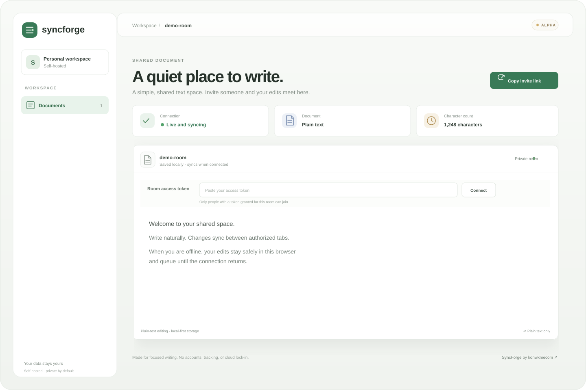

<div align="center">
  

  # SyncForge

  **A calm, self-hosted space for collaborative plain-text writing.**

  <p>
    <a href="https://github.com/konwxmecom/SyncForge/actions/workflows/ci.yml"></a>
    
    
  </p>
</div>

<p align="center">
  
</p>

SyncForge is an open-source collaborative plain-text editor project by **[konwxmecom](https://github.com/konwxmecom)**. A TypeScript sequence CRDT powers local editing and convergence; a Go WebSocket service handles authorized rooms and durable operation history. Each browser keeps its own offline state.

> **Project scope:** The plain-text alpha implementation is complete. SyncForge is a working prototype, not a production-ready hosted service. Rich text, user accounts, multi-server storage, and automated operations are future work.

## Highlights

- Deterministic insert/delete CRDT operations that converge across replicas.
- IndexedDB snapshots and an offline operation queue with reconnect and replay.
- Versioned WebSocket protocol, bounded history replay, and a Go sync service.
- Required bearer-token room authorization with explicit document grants.
- Durable append-only operation logs and restart recovery.
- Loopback-first defaults, connection and message-rate ceilings, health endpoints, and basic metrics.
- TipTap plain-text demo with ephemeral cursor presence.
- Owner-only backup archive script for stopped-service backups.

## Get started

### Requirements

- Node.js 22 or a compatible version supported by the project dependencies.
- Go 1.22 or later.
- A modern browser with WebSocket and IndexedDB support.

Install dependencies and create a local authorization file:

```sh
npm ci
cp auth.example.json auth.local.json
chmod 600 auth.local.json
```

Replace the example token in `auth.local.json` with a newly generated random secret of at least 32 characters. This local file is ignored by Git.

Start the server:

```sh
AUTH_FILE=./auth.local.json npm run dev:server
```

In a second terminal, start the demo:

```sh
npm run dev:demo
```

Open <http://localhost:5173/?doc=demo-room>, enter the configured room token, and select **Connect**. Open the same URL in another authorized tab to try collaborative editing.

### Docker

```sh
cp .env.example .env
cp auth.example.json auth.local.json
chmod 600 auth.local.json
# Replace the example token before starting.
docker compose up --build
```

Open <http://localhost:5173/?doc=demo-room>. Both published ports bind to loopback. Read [the reverse-proxy notes](docs/reverse-proxy.md) before exposing a deployment.

## Verify and build

```sh
npm test
npm run build:demo
cd server && go test -race ./... && go vet ./...
cd ..
npm run benchmark:core
```

The benchmark measures a deterministic, in-process CRDT workload. It is not a network or production-capacity test. Continuous checks are defined in [the GitHub Actions workflow](.github/workflows/ci.yml).

## Configuration and safety

| Variable | Default | Purpose |
|---|---|---|
| `ADDR` | `127.0.0.1:8080` | HTTP/WebSocket listener; use a private interface behind trusted TLS for deployment |
| `DATA_DIR` | `./data` | Owner-only operation log directory |
| `AUTH_FILE` | Required | Owner-only token-to-document grants; server refuses startup if invalid or unset |
| `MAX_CONNECTIONS` | `256` | Per-process WebSocket connection ceiling |
| `MAX_CONNECTIONS_PER_DOCUMENT` | `32` | Per-document connection ceiling |
| `MAX_MESSAGES_PER_MINUTE` | `600` | Inbound messages per connection per minute |

- `GET /healthz` is a liveness check; `GET /readyz` confirms startup configuration was accepted.
- `GET /metrics` exposes low-cardinality connection and room gauges. Keep it private; it has no authentication.
- Configure trusted TLS termination and use `wss://` for network deployments.
- Limits are initial safety ceilings, not tested capacity guarantees. The service is single-process and has no global disk/memory quota or distributed coordination.

See [BUILD.md](BUILD.md) for architecture, backup/restore instructions, protocol details, and explicit limitations.

## License

SyncForge project code is distributed under the [MIT License](LICENSE), copyright **konwxmecom**. Third-party packages retain their own licenses; see [THIRD-PARTY-NOTICES.md](THIRD-PARTY-NOTICES.md).
